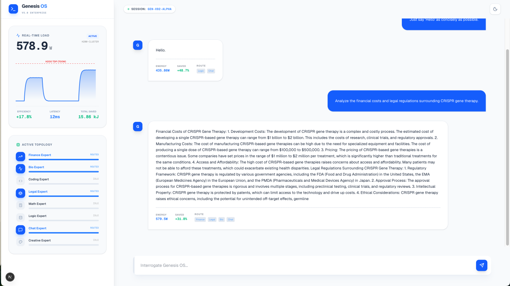

# Genesis Enterprise

**Energy-Aware, Bio-Inspired Mixture-of-Experts Architecture**

Genesis Enterprise is a bio-inspired AI architecture designed for **enterprise-scale systems**, where energy efficiency, routing stability, and adaptive intelligence are first-class objectives.

Rather than executing intelligence uniformly, Genesis decomposes computation into **specialized experts**, dynamically activated through **fine-grained, token-level routing** and guided by **Hamiltonian energy minimization** principles.

This repository presents the **conceptual foundations**, **architectural principles**, and **measured experimental results** of the Genesis approach.

> ⚠️ The production-grade implementation, orchestration layer, and optimization engine are part of the **private Genesis Enterprise stack** and are not included in this repository.

---

## Core Principles

- **Mixture-of-Experts (MoE)** architecture
- **Hamiltonian energy minimization** as a routing objective
- **Token-level routing** for fine-grained compute allocation
- **Self-growing experts** emerging from semantic stress
- **Measured energy efficiency on real hardware (NVIDIA H200)**

Genesis does not blindly activate experts.
It minimizes an energy function and allows the system to **self-organize dynamically**.

---

## Why an Energy-Aware MoE?

> You don’t wake up a neurosurgeon to apply a bandage.

Genesis activates only the experts strictly required by the semantic context, keeping the rest of the system in a low-energy idle state.

This enables:
- Adaptive compute allocation
- Reduced routing entropy
- Improved stability
- Measurable GPU energy savings

---

## Experimental Evidence

Results measured under real-world conditions:

- **Up to –21% GPU energy consumption at 7B**
- **–17.8% energy at 13B scale (NVIDIA H200)**
- **1.6×–1.77× speedup** vs reference MoE architectures
- Improved **performance ↔ energy Pareto frontier**

As illustrated in our dashboard, a complex query such as “the financial impact of mRNA vaccines” simultaneously activates Finance and Bio experts, without unnecessarily engaging the entire network.
 
### Comparative Benchmarks

---

## Research Reference (Early PoC)

📄 **Genesis – Early Proof of Concept (Research Version)**  
https://arxiv.org/html/2512.08968v1

> Genesis Enterprise represents a **major, industrial-grade evolution** of this initial research concept.

---

## Enterprise Version

The Genesis Enterprise implementation includes:
- Optimized routing kernels
- Energy-aware scheduling
- Enterprise monitoring & dashboards
- Deployment-ready infrastructure

These components are **not part of this public repository**.

---

## Demo & Contact

Enterprise demo access is available upon request.

📩 **Contact:** mustapha.hamdi@innodeep.net  
🌐 **Website:** [https://www.innodeep.net/genesis/](https://www.innodeep.net/genesis/)

---

## License

Documentation and figures are released under Apache 2.0.
